# Quixo Final Project

>[!IMPORTANT]
> This work was made with:
> - [Ivan](https://github.com/ivanmag22/)
> - [Francesca](https://github.com/Zafonte)
> - [Rita](https://github.com/class1c-j)

## Brief introduction

### The Game
25 cubes are placed in the centre of the board. Each cube is characterised by its top face: blank face, or face
with a circle or cross. At the beginning of the game, the cubes all have a blank top face. The two
players or teams choose who plays with crosses, who plays with circles, and who is to start. The goal of the game is
To make a horizontal, vertical or diagonal line from 5 cubes bearing your symbol.

### Our Work
Since we worked in four, for this project we decided to cover the main approaches that we studied during the course. These approaches are:
- MinMax
- AlphaBetaPruning
- MonteCarlo RL
- Q-Learning
- ES 1+λ: one implementation against Random Agent and one against AlphaBetaPruning Agent

All these algorithms are written in Jupyter Notebooks (.ipynb). This allow us to better organize the work and to make it more readable. 
The project required us to develop different Agents able to play Quixo. The provided template presents a Game Class with all the methods useful to do a match game against another Agent. The default opponent is a Random Player which strategy is to perform a random move starting from a random position in the table. 

We subclassed the ___Game Class___ in order to write some methods that are pretty useful to better visualize what is going on and to provide our agents functional tools. For doing it, we implement our  ___MyGame Class___. There some functions in this Class that are used in all the files, while others are specific for some agents. 
Here a short overview of some methods of ___MyGame Class___ (Other functions are commented in the description of the specific approaches):

- `get_possible_moves(self, game: "MyGame") -> list[tuple[tuple[int, int], Move]]`
   - It returns a list with all the possible moves that a player (tipically a Random one) can do.

- `print(self, from_pos: tuple[int, int], slide: Move, player_id: int) -> bool`
   - Prints the board. '-' are neutral pieces, 'O' are pieces of player 0, 'X' pieces of player 1. 

- `is_valid(self, from_pos: tuple[int, int], slide: Move, player_id: int) -> bool`
   - It returns a Boolean value that tells us if a move for a player is valid or not. It is useful for _get_possible_moves()_ method.

- `move(self, from_pos: tuple[int, int], slide: Move, player_id: int) -> bool`
   - Just to call *__move()* method from Game class; the method is private, but in MyGame we use it as public.

We provide a folder in this repository named *pretrained_agents*:
- **Q_Learning_agent**: it includes the file of the trained q-table splitted into three small .rar files. You have to extract all of them in one single file. 
- **es_agents**: it includes pretrained agents based on different parameters configuration.  
  - For Quixo_ES.ipynb the pretrained files are the following:
    - _lambda_20_training_60_training_fitness_60_rules_9_initialsigma_0.35_random.pkl_
    - _lambda_20_training_70_training_fitness_80_rules_14_initialsigma_0.35_final_0.08_random.pkl_

  - For Quixo_ES_alpha_beta.ipynb:
    - _lambda_10_training_2_fitness_5_rules_14__highersigma_alphabeta.pkl_
  
- **mc_agents** : it includes two trained dictionaries. One computed by our player starting as first and one as second. These files are in .rar format, **please unzip them**.

All the pretrained files must be located in the same folder in which there is the correspondent algorithm. In the notebook files **please pay attention to the path constant**.

### MinMax 
The code in the file Quixo_Minmax.ipynb proposed an Agent able to take a move after exploring the tree game according to the minmax function. This is a recursive function which goal is to maximize the minumum of the reward. What does it means? In the MinMax algorithm the agent starts from the leaf ot the tree and goes up  maximizing and minimizing level by level. Since the agent is expecting that the opponent plays in an optimal way, it searches the best move to apply by exploring the game tree. The applied move is always the _best_move_ for our Agent in the worst possible scenario. Since the _branching factor_ is huge and the tree is very deep (with respect to more simple game such as _Tic_Tac_Toe_) we have to set a kind of _hard cut off_ for limiting the depth of the search at a certain level. In fact, we have like $1.7 * 10^{12}$ configurations. So the complexity grows and it is very time consuming exploring the whole tree. 
The _minimax()_ method is our main method that maximizes agent's reward and minimizes opponent's one. It is called by the _best_move()_ method that iterates through all possible moves, calculates their scores using the minimax function, and returns the move with the highest score. The condition stop is satisfied if it finds the terminal node that brings to a win or to a lose or if it reaches a predefined depth. When the game stop, a heuristic function is called and it returns a value between -0.5 and +0.5 if it is evaluating an intermediate node, while it returns +1 if our Agent is the winner or -1 if the opponent wins.
The evaluation of an intermediate node is possible thanks to the longest_sequence function.

- Overview of the evaluation function in terms of "reward":

| Condition      | Value |
| -------------- | ----- |
| The agent won  | +1    |
| The agent lost | -1    |
| Otherwise      | Size of the agent's biggest sequence normalized to the interval [-0.5, 0.5] |

**Other useful methods in MyGame Class**

- `longest_sequence(self, player_id: int) -> int` 
  - It is implemented in the _MyGame Class_. It returns the length of the longest sequence of pieces of the same player.
 

**Results**
As we said, we set a limit in depth. The following results represent the percentage of time in which our agent is winning against a Random Player with different depths. The number of games played is not so big, so you can not appreciate a lot in some cases (for instance between _depth=1_ and _depth=2_) the fact that if we explore more depth in the tree we can have better results.

- ***Winning percentages***            
   
   - depth = 1 W=1, L=-1, 30 games, for an intermediate node we have a heuristic function called longest_sequence and its returned value is normalized in order to have a value between -0.5 and +0.5:
      - 
   
   - depth = 2 W=1, L=-1, 30 games, for an intermediate node we have a heuristic function called longest_sequence and its returned value is normalized in order to have a value between -0.5 and +0.5
      - 
   
   - depth = 2 W=1, L=-1, 10 games, for an intermediate node we have a heuristic function called longest_sequence and its returned value is normalized in order to have a value between -0.5 and +0.5 
      - 
        
   - depth = 3 W=1, L=-1, 30 games, for an intermediate node we have a heuristic function called longest_sequence and its returned value is normalized in order to have a value between -0.5 and +0.5
      - 
   
   - depth = 2 W=1, L=-1, 5 games,ONE random game to decide the value of an intermediate node (3h around on Colab)
      - 
   
   
- ***Time for each move***
   
   | Depth                            | Time for each move (maximum values)                 |
   | -------------------------------- | ---------------------- |
   | 1                                | 0.139 s                |
   | 2                                | 4.398 s                |
   | 3                                | 186.110 s              |
   

### AlphaBetaPrunuing
The code in the file Alpha_beta_pruning_quixo.ipynb is a variant of the MinMax algorithm, but faster. It does not change the nature of the algorithm itself. The base idea is that one of __Pat Winston__ : "If you have an idea that is surely bad, don't take the time to see how trurly awful it is".
Thus, instead of exploring the whole tree, this algorithm cuts off some branches if some conditions are satisfied. In particular, it checks the values of two variables, alpha and beta: if one of them is higher or equal to the other, the branch is cut. In this manner, it is possible to proceed quickly in the exploration. As in the minimax approach, we recur to _minimax()_ function that presents the updating of some variables at the end of each maximization/minimization stage. On one hand during the maximization stage: best_score=max(score, best_score) and  alpha = max(alpha, score). On the other hand, in minimization stage: best_score = min(score, best_score), beta=min(beta, score)). Then, there is a condition that checks if that branch has to be cut off or less (if beta <= alpha: break). 
Also in this case it is possible to establish a depth where end our exploration.

- Overview of the evaluation function in terms of "reward":

| Condition      | Value |
| -------------- | ----- |
| The agent won  | +1    |
| The agent lost | -1    |
| Otherwise      | Size of the agent's biggest sequence normalized to the interval [-0.5, 0.5] |

**Results**

- ***Winning percentages***
      
   - depth = 1 W=1, L=-1, 30 games, for an intermediate node we have a heuristic function called longest_sequence and its returned value is normalized in order to have a value between -0.5 and +0.5 
    - 
   
   - depth = 2 W=1, L=-1, 30 games, for an intermediate node we have a heuristic function called longest_sequence and its returned value is normalized in order to have a value between -0.5 and +0.5
     - 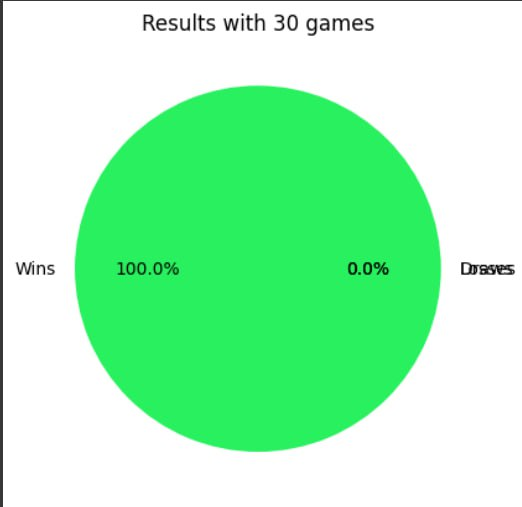
   
   - depth = 3 W=1, L=-1, 30 games, for an intermediate node we have a heuristic function called longest_sequence and its returned value is normalized in order to have a value between -0.5 and +0.5
     - 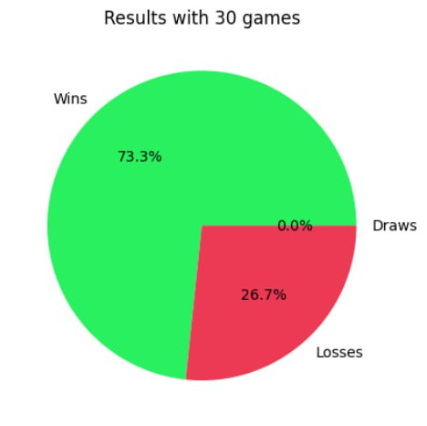
   
   - depth = 4 W=1, L=-1, 30 games, for an intermediate node we have a heuristic function called longest_sequence and its returned value is normalized in order to have a value between -0.5 and +0.5
     - 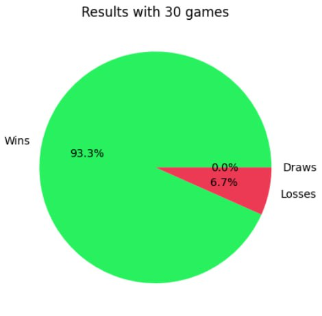
   
   - depth = 4 W=1, L=-1, 9 games, for an intermediate node we have a heuristic function called longest_sequence and its returned value is normalized in order to have a value between -0.5 and +0.5 (around 25m)
     - 9 wins -> 100% win 

- ***Time for each move***
   
   | Depth                            | Time for each move (maximum values)                 |
   | -------------------------------- | ---------------------- |
   | 1                                | 0.233 s                |
   | 2                                | 2.09 s                 |
   | 3                                | 15.244 s               |
   | 4                                | 111.433 s              |
   | 5                                | 469.711 s              |
   

### MonteCarlo RL
In the file Quixo_MonteCarlo.ipynb it is possible to find a RL Agent that learns with a MonteCarlo approach.
The Monte Carlo method for reinforcement learning is a learning algorithm that learns directly from the environment without any prior knowledge. It is used for estimating the value of states.
We implemented a random game and then we keep track of all the states. Then we evaluate them using the following expression: 

`value_dict[state] = value_dict[state] + epsilon * (final_reward - value_dict[state])`

where the _final_reward_ is the final state rating. If our player wins, he will receive a positive reward(**reinforcement**) otherwise a negative reward. The idea is therefore to build a dictionary of states with relative evaluation that the agent can check to make decisions. 
 
- Overview of the evaluation function (_state_value()_) in terms of "reward":

| Condition      | Value |
| -------------- | ----- |
| The agent won  | +1    |
| The agent lost | -1    |
| Otherwise      |  0    |

**Other useful methods in MyGame Class**
- `get_rotations(self)`
  - this function generate rotations of a game board
    
- `get_symmetries(self)`
  - it calculate all the possible symmetries of the board
 
- To keep the q table, we use a dictionary. For that we implement the `__hash__` and `__eq__` functions for the `MyGame` function so we can use those objects as part of the key. Additionally, we also use these functions to match elements that are symetries/rotations of the original board, for efficiency.
  
**Results**

- EPISODES_TRAINING = 200k, 100 games, Montecarlo Player as firt  
  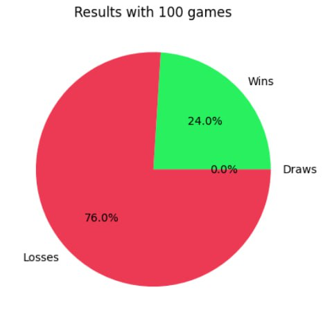

- EPISODES_TRAINING = 200k, 100 games, Montecarlo Player as second  
  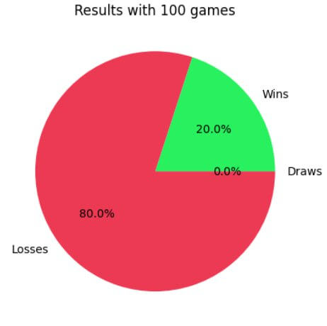

### Q-Learning

For the Model-Free Q-Learning agent (`QPlayer`, found in `Quixo_QLearning.ipynb`) we implemented an agent that learns to play by performing actions chosen through a epsilon-greedy stategy. It is rewarded for each of them (actions), allowing to later choose the actions that will lead to the best reward for each state in a game.

For each action it performs, the q-table is updated using the formula $Q(s_t, a_t) \leftarrow (1 - \alpha) * Q(s_t, a_t) + \alpha * (r + \gamma * max_a(s_{t+1}, a_{t + 1}))$.
  
Since Quixo is a two-player game, we need to simulate the opponent's moves as part of the environment, and, only then, update the table. To approach that, we consider the start of the agent's turn to be $s_t$, which transitions to state $s_{t+1}$ after the agent's action. Then, we simmulate the opponent's action, transitioning to state $s_{t + 2}$, where we finally update the table in respect to $s_t$.

- Our reward function is defined as follows:

| Condition                            | Reward                 |
| ------------------------------------ | ---------------------- |
| Play a winning move                  | +1                     |
| Play a loosing move                  | -1                     |
| Increase own biggest sequence        | + sequence size / 5    |
| Decrease own biggest sequence        | - sequence size / 5    |
| Increase opponent's biggest sequence | - sequence size / 5    |
| Decrease opponent's biggest sequence | + sequence size / 5    |

**Other useful methods in MyGame Class**

- To keep the q table, we use a dictionary. For that we implement the `__hash__` and `__eq__` functions for the `MyGame` function so we can use those objects as part of the key.

**Results**

- EPISODES_TRAINING = 500k, 100 games
  - 

###  ES 1+λ
The code in the file Quixo_ES.ipynb describes the behaviour of our ES agent.

The **Evolutionary Strategy** is an approach that allows to select the individual that performs better in a specific task. In our case we are looking to the best  configuration of weights for the actions with which our agent plays against the _Random Player_. We adopted a **(1+λ)-ES** that in each epoch generates λ offspring from a parent and that evaluates all of them with a *fitness function*. We use a dictionary of *rule- (action-weight)*. Each of these *weights*  represents a probability.  The *set_dictionary()* method is used to zip the _CONDITIONS_ and _ACTIONS_ lists to form the *rule-action couples*.

The **list of rule-action couples** is the following, where some couples are more specific than others:

- **r1-a1**: if there is a *row* without a cube with agent's face, then it pushes the cube there (it is a guarantee that on every row there is at least one agent's cube)
- **r2-a2**: if there is a *column* without a cube with agent's face, then it pushes the cube there (it is a guarantee that on every column there is at least one agent's cube)
- **r3-a3**: if the *agent* is doing 5 in a *row* (where 4 of its cubes are consecutive), then it pushes there a cube in order to do the winning move
- **r4-a4**: if the *agent* is doing 5 in a *column* (where 4 of its cubes are consecutive), then it pushes there a cube in order to do the winning move
- **r5-a5**: if the *agent* is doing 5 in a *main/secondary diagonal* (where 4 of its cubes are consecutive), then it pushes there a cube in order to do the winning move
- **r6-a6**: if the *opponent* is doing 5 in a *row* (where 4 of its cubes are consecutive), then the *agent* pushes there a cube with its face in order to block opponent's possible winning move
- **r7-a7**: if the *opponent* is doing 5 in a *column* (where 4 of its cubes are consecutive), then the *agent* pushes there a cube with its face in order to block opponent's possible winning move
- **r8-a8**: *unoptimal move*! It represents a *bad rule* that brings to a lose. Indeed, if the *opponent* is going to do 5 in a *row/column/main diagonal/secondary diagonal*, the agent *DOES NOT block* the winning move (if and only if at the extremes there are cubes with our face or without face)
- **r9-a9**: if the *opponent* is doing 5 in a *main/secondary diagonal* (where 4 of its cubes are consecutive), then the *agent* pushes there a cube with its face in order to block opponent's possible winning move
- **r10-a10**: if in one *row* there are *at least 3 cubes* with *agent*'s symbol (not necessarly consecutive), then it tries to put a cube there
- **r11-a11**: if in one *column* there are *at least 3 cubes* with *agent*'s symbol (not necessarly consecutive), then it tries to put a cube there
- **r12-a12**: if in one *row* there are *at least 3 cubes* with *opponent*'s symbol (not necessarly consecutive), then the agent tries to put a cube there to block opponent's possible winning move
- **r13-a13**: if in one *column* there are *at least 3 cubes* with *opponent*'s symbol (not necessarly consecutive), then the agent tries to put a cube there to block opponent's possible winning move
- **r14-a14**: *the simplest couple rule-action*! If the agent finds an available cube or with its face on the perimeter, it does a random move from those allowed

In the file there is a code cell called *TESTER RULE-ACTIONS* useful where we tested the effectiveness of rule-action couples: we set the board that we wanted to test with *MyGame.set_board()* method and then we applied the desired couple in order to understand if it respects the condition (value returned by *rule()*) and to see the applied move from the current board in the future one (applying *MyGame.move()* with the parameters returned by *action\[0\]()*).

During a *match* (for both training and testing) the agent selects couples of rule-action that satisfies a certain situation (with *test_conditions()* method) and it picks one according to a *weighted roulette-wheel selection*, returned by *voting()* method. 

At
- **training time**, *adaptive()* method is called to play a match with the given individual
- **test time**, *make_move()* is called to do the same but with the best (individual) configuration of weights found so far.

The first function to be called is *ES_1_plus_lambda()* that for a certain number of epochs (*EPISODES_TRAINING*) it generates individuals (by perturbing the weights of the best solution found so far, with a normal distribution) and compare them to get the best. At each epoch the *fitness()* function is called in order to evaluate the individual passed as argument: it plays for a certain number of matches (*EPISODES_TRAINING_FITNESS*) against the Random player and it is evaluated by its percentage of wins.

There is a *steady-state condition* for which, if a better solution is not found in a certain number of epochs (defined by *TOLERANCE_EPOCHS*), it breaks the search of new individuals.

**Other useful methods in MyGame Class**

- `set_board(self, board)`
   - It is useful to set a particular board in a MyGame object.

**Results**

**Results**
We have tested the ES player training it with several configurations and playing with it as first or second player. Many of these tests were against Random player changing some parameters like the number of episodes (*EPISODES_TRAINING_FITNESS*), epochs (*EPISODES_TRAINING*), individuals (*λ*) or exploration rate (*initial_σ* and *final_σ*).

- **PLAYER 1**
     
   - EPISODES_TRAINING = 45, EPISODES_TRAINING_FITNESS = 35, EPISODES_GAME = 100, NUMBER_OF_RULES = 8 (commented 1,2, 10,11,12,13), LAMBDA = 17, INITIAL SIGMA = 0.2 , FINAL_SIGMA = 0.02, training against random, initialweights small random as the configuration of the final code:

     - Best_fitness =  0.6571428571428571  
     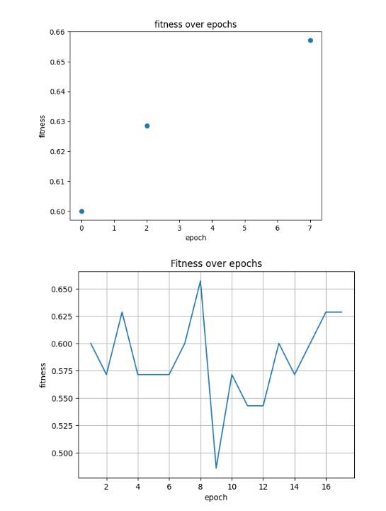

     - ES agent wins = 42%  
     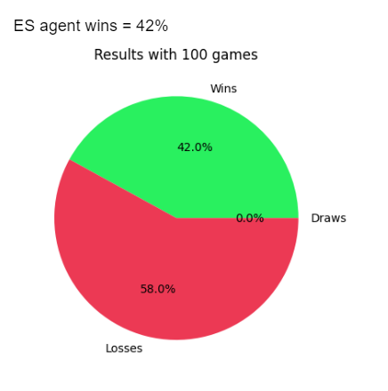

   - EPISODES_TRAINING = 110, EPISODES_TRAINING_FITNESS = 40, EPISODES_GAME = 100, NUMBER_OF_RULES = 8 (commented 1,2, 10,11,12,13), LAMBDA = 20, INITIAL SIGMA = 0.35 , FINAL_SIGMA = 0.02, training against random, initialweights small random as the configuration of the final code:

   - Best_fitness =  0.675  
   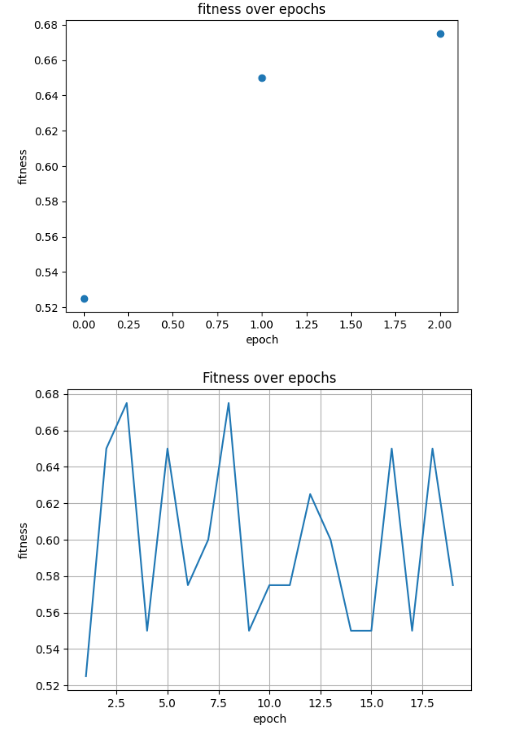
   
   - ES agent wins = from 41% to 48%  
   

   - EPISODES_TRAINING = 60, EPISODES_TRAINING_FITNESS = 60, EPISODES_GAME = 100, NUMBER_OF_RULES = 9 (commented 2, 10,11,12,13), LAMBDA = 20, INITIAL SIGMA = 0.35 , FINAL_SIGMA = 0.02, training against random, initialweights small random as the configuration of the final code:

   - Best_fitness =  0.8166666666666667  
   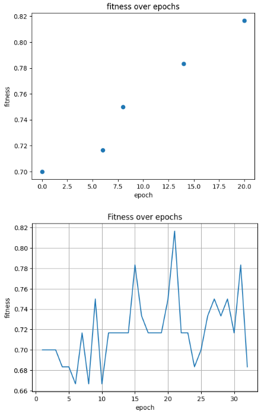
   
   - ES agent wins =  from 57%  to 61%  
   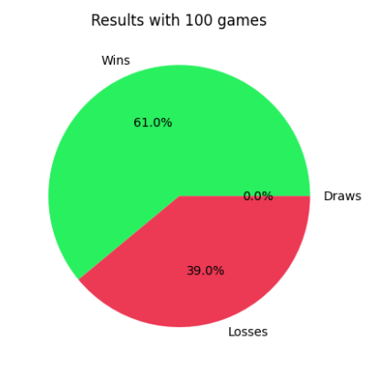

   - EPISODES_TRAINING = 60, EPISODES_TRAINING_FITNESS = 70, EPISODES_GAME = 100, NUMBER_OF_RULES = 10 (commented 10,11,12,13), LAMBDA = 20, INITIAL SIGMA = 0.35 , FINAL_SIGMA = 0.05, training against random, initialweights small random as the configuration of the final code:

     - Best_fitness =  0.8571428571428571  
     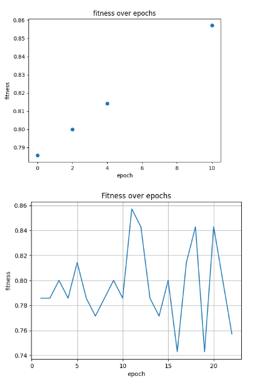

     - ES agent wins =  69%  
     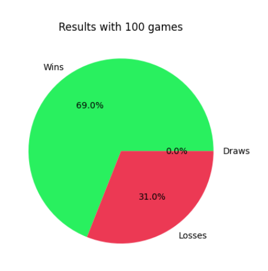

    - EPISODES_TRAINING = 70, EPISODES_TRAINING_FITNESS = 80, EPISODES_GAME = 100, NUMBER_OF_RULES = 14, LAMBDA = 20, INITIAL SIGMA = 0.35 , FINAL_SIGMA = 0.08, training against random, initialweights small random as the configuration of the final code:

      - Best_fitness =  0.9625  
      

      - ES agent wins =  94%  
      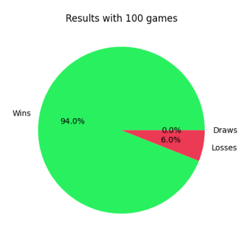

- **Player 2**
A few tests were conducted training the agent against the Alpha-Beta player and we found that, even if it was trained for 2 epochs, it performs well against the Random player because it was trained with an more expert agent than Random agent. In this case our agent played as second player.

   - EPISODES_TRAINING = 2, EPISODES_TRAINING_FITNESS = 5, EPISODES_GAME = 100, NUMBER_OF_RULES = 14, LAMBDA = 10, INITIAL SIGMA = 0.2 , FINAL_SIGMA = 0.02, training against Alpha Beta pruning Player, initial weights small random as the configuration of the final code:

     - Best_fitness = 0.6 (1 hour around on Google Colab)   
     

     - ES agent wins: 84% around of the games against Random Player   
     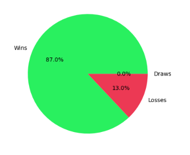

     - Es agent wins: 10% around against Alpha Beta player   
     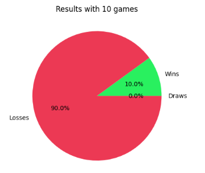

